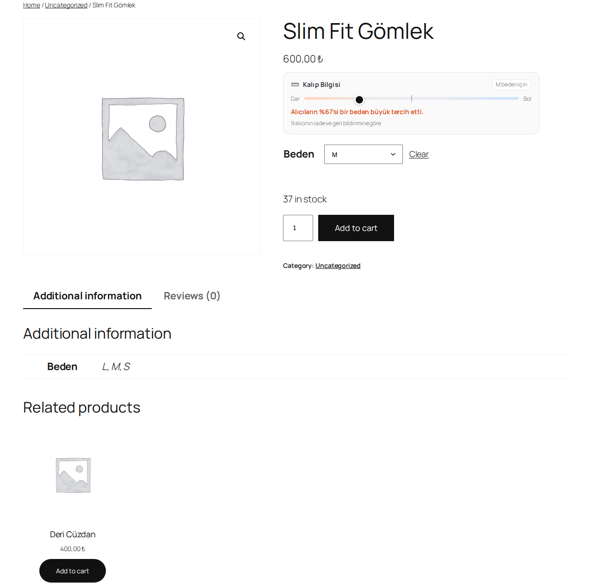
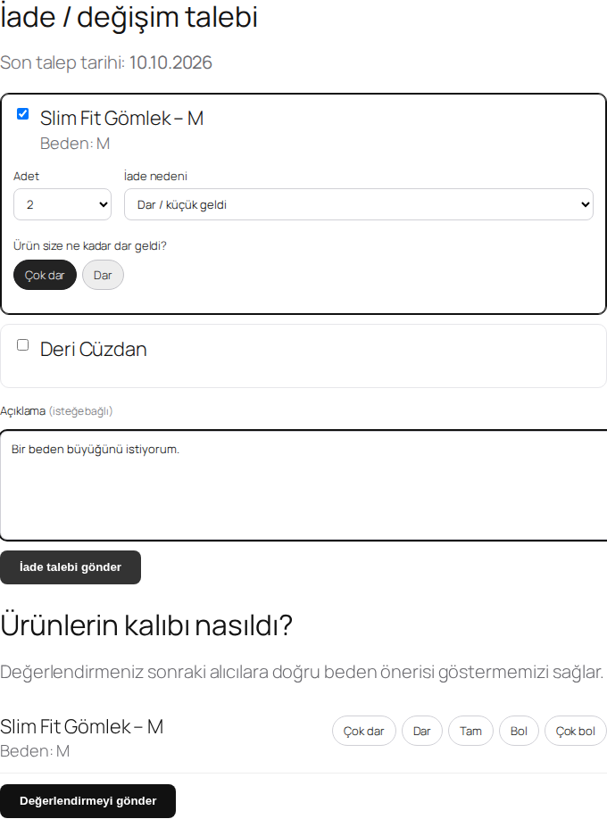
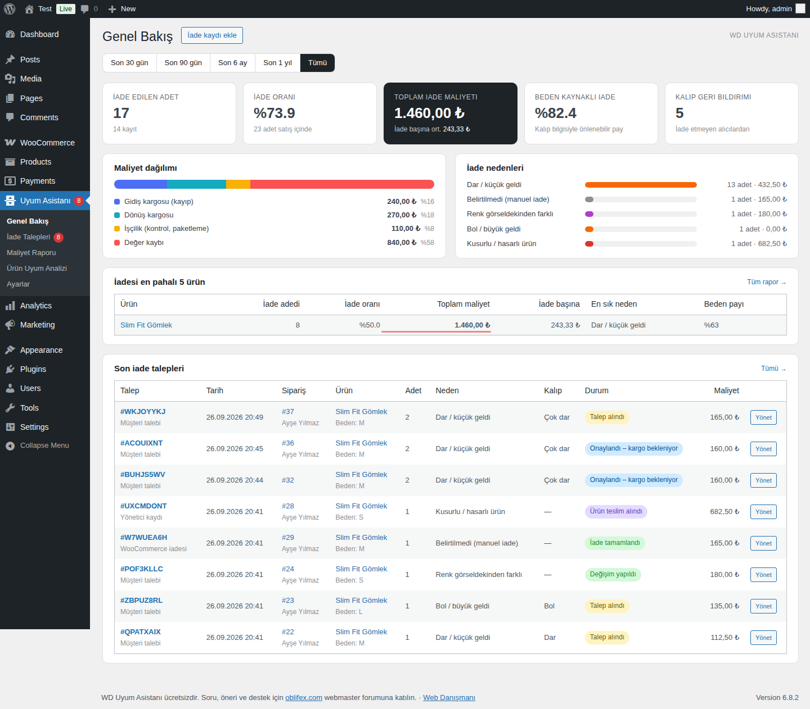
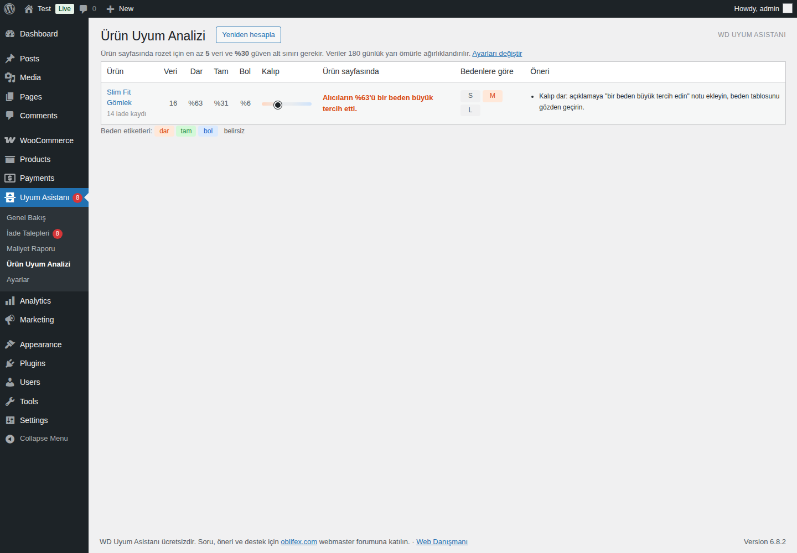
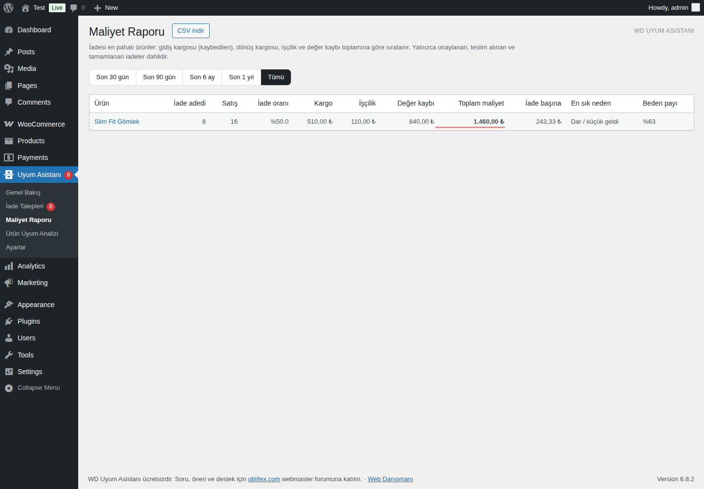
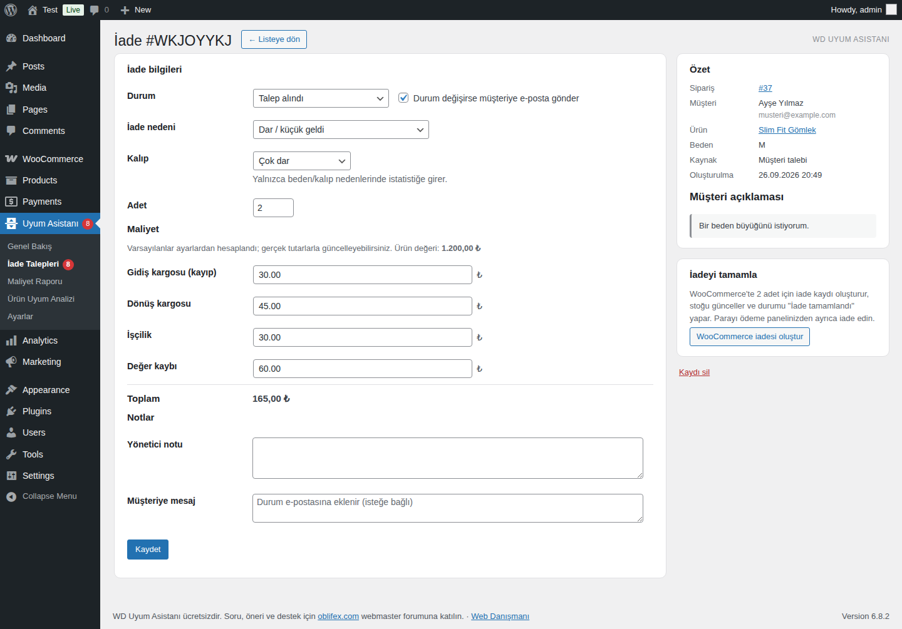

# 📏 WD Uyum Asistanı

**İade verisinden öğrenen beden/kalıp asistanı ve iade maliyet raporu (WooCommerce için)**

*"Alıcıların %62'si bir beden büyük tercih etti."* Bu cümle tahmine değil, mağazanızın gerçek iade ve alıcı verisine dayanır.

### 💬 Destek, soru ve öneriler: **[oblifex.com](https://oblifex.com)**
Türkiye'nin webmaster forumu: WordPress, WooCommerce, sunucu, SEO ve e-ticaret üzerine konuşuyoruz.

---

## Neden bu eklenti?

Giyim ve ayakkabı mağazalarında iadelerin büyük kısmı **beden** kaynaklıdır. Her iade, iki yönlü kargo, işçilik ve değer kaybı demektir. Sabit bir beden tablosu bu sorunu çözmez, çünkü her ürünün kalıbı farklıdır.

**WD Uyum Asistanı**, müşterilerinizin iade nedenlerini ve iade etmeyen alıcıların "kalıp nasıldı?" cevaplarını ürün ve beden bazında toplar. Veri yeterli ve güvenilir hale geldiğinde bunu ürün sayfasında sonraki alıcılara gösterir. Aynı veriyle, hangi ürünün iadesinin size kaça mal olduğunu da raporlar.

## Ekran görüntüleri

| Ürün sayfası | İade talebi (Hesabım) |
|---|---|
|  |  |

| Genel bakış | Ürün uyum analizi |
|---|---|
|  |  |

| Maliyet raporu | İade yönetimi |
|---|---|
|  |  |

## Özellikler

### 🛍️ Mağaza tarafı
- **Kalıp rozeti:** Ürün sayfasında Dar–Bol ölçeği ve *"Alıcıların %62'si bir beden büyük tercih etti."* mesajı gösterilir.
- **Bedene özel sonuç:** Müşteri beden seçtiğinde o bedenin verisi gösterilir (örneğin "M beden için").
- **Doğru Türkçe ekler:** %62'si, %40'ı, %100'ü, %63'ü gibi ekler otomatik olarak doğru yazılır.
- **İade/değişim talebi:** Müşteri, *Hesabım > Siparişler* ekranından ürünü, adedi ve nedeni seçer. Beden kaynaklı nedenlerde ne kadar dar ya da bol geldiğini de belirtir.
- **"Kalıp nasıldı?" anketi:** İade etmeyen alıcılardan tek tıkla geri bildirim alınır. Sipariş tamamlandıktan birkaç gün sonra otomatik e-posta gider. Beden niteliği olmayan ürünlerde bu soru sorulmaz.
- **Tema uyumu:** Klasik ve blok (FSE) temalarla çalışır. `[wdua_kalip]` kısa kodu da kullanılabilir.

### 📊 Yönetim paneli
- **Genel bakış:** İade oranı, toplam iade maliyeti, beden kaynaklı iade payı, maliyet dağılımı ve neden dağılımı.
- **Maliyet raporu:** İadesi en pahalı ürünler listelenir. Gidiş kargosu, dönüş kargosu, işçilik ve değer kaybı ayrı ayrı gösterilir. Excel uyumlu CSV olarak indirilebilir.
- **Ürün uyum analizi:** Dar/tam/bol oranları ve beden bazında sapmalar görülür. Otomatik öneriler sunulur, örneğin "L bedeni diğerlerinden farklı davranıyor" veya "iadelerin %30'u renk kaynaklı, ürünü yeniden fotoğraflayın".
- **İade yönetimi:** Durum takibi (talep alındı → onaylandı → teslim alındı → tamamlandı/değişim/red), müşteriye e-posta bildirimi ve maliyetlerin elle düzeltilmesi.
- **Tek tıkla WooCommerce iadesi:** İade kaydı oluşturulur ve ürün stoğa geri eklenir. Ödeme sağlayıcısına otomatik para iadesi **gönderilmez**; bu kararı siz verirsiniz.
- **Elle yapılan iadeler:** WooCommerce'te elle yapılan iadeler de otomatik olarak kayda geçer. Nedenini sonradan düzenleyebilirsiniz.
- **Sipariş ve ürün ekranı kutuları:** Siparişin iadelerini görüp yeni kayıt ekleyebilirsiniz. Ürün bazında rozeti gizleyebilir veya manuel kalıp notu yazabilirsiniz.
- **Para birimi biçimi:** Tutarlar WooCommerce ayarlarınızdaki biçimle yazılır (örneğin `1.369,50 ₺`).

## Nasıl hesaplıyor?

Basit bir yüzde, az veride yanıltıcı olur: 3 iadenin 3'ü "dar" diyorsa %100 çıkar. Bu yüzden eklenti üç önlem kullanır:

1. **Dengeli veri:** Yalnızca iade edenler değil, ürünü beğenip tutan alıcıların "tam oldu" cevapları da hesaba girer.
2. **İstatistiksel güven:** Karar, Wilson güven aralığının alt sınırıyla verilir. Veri yetersiz veya karışıksa rozet gösterilmez. Yanlış bir bilgi göstermektense hiç göstermemek daha iyidir.
3. **Zaman ağırlığı:** Eski veriler, ayarlanabilir bir yarı ömürle (varsayılan 180 gün) etkisini kaybeder. Tedarikçi kalıbı değiştirdiğinde rozet de kendiliğinden güncellenir.

Maliyet her iade için şöyle hesaplanır: **gidiş kargosu (adede oranlanır) + dönüş kargosu + işçilik + değer kaybı (nedene göre %)**. Tüm tutarlar ayarlardan değiştirilebilir ve her kayıtta elle düzeltilebilir.

## Kurulum

1. [Releases](../../releases) sayfasından `wd-uyum-asistani.zip` dosyasını indirin.
2. WordPress panelinde **Eklentiler > Yeni Ekle > Eklenti Yükle** ile zip'i yükleyip etkinleştirin.
3. **Uyum Asistanı > Ayarlar** ekranında şunları kontrol edin:
   - **Beden nitelikleri:** Mağazanızdaki beden niteliğinin adı (varsayılan: `pa_beden, beden, pa_numara, pa_size`).
   - **Maliyet varsayılanları:** Kargo ve işçilik tutarlarınız.
   - **İade süresi:** Varsayılan 14 gün.

> Git ile kuruyorsanız klasörü `wp-content/plugins/wd-uyum-asistani` olarak klonlayın.

## Gereksinimler

- WordPress 6.0+
- WooCommerce 7.0+ (HPOS açık veya kapalı)
- PHP 7.4+ (PHP 8.4 ile test edildi)

## Geliştiriciler için

| Kanca | Tür | Açıklama |
|---|---|---|
| `wdua_reasons` | filter | İade nedenlerini değiştirin veya yeni neden ekleyin |
| `wdua_computed_costs` | filter | Maliyet hesaplamasını özelleştirin |
| `wdua_item_accepts_feedback` | filter | Hangi kalemlerden kalıp geri bildirimi istenecek |
| `wdua_badge_html` | filter | Ürün sayfası rozetinin HTML'i |
| `wdua_admin_email` | filter | Yeni talep bildiriminin gideceği adres |
| `wdua_request_created` | action | Müşteri iade talebi oluşturduğunda |
| `wdua_return_updated` | action | İade kaydı güncellendiğinde |
| `wdua_stats_rebuilt` | action | Ürün istatistiği yeniden hesaplandığında |

Veriler `{prefix}wdua_returns` ve `{prefix}wdua_feedback` tablolarında tutulur. Ürün istatistikleri `_wdua_stats` meta alanında önbelleğe alınır ve her gün yenilenir.

## Destek ve katkı

- 💬 **Soru, hata bildirimi ve öneriler:** [oblifex.com](https://oblifex.com). Forumda konu açın, hem biz hem diğer webmasterlar yardımcı olur.
- 🐛 Hata bildirimi için GitHub [Issues](../../issues) da kullanılabilir.
- 🔧 Pull request'lere açığız.

Eklentiyi faydalı bulduysanız repoya ⭐ vermeniz ve [oblifex.com](https://oblifex.com)'da deneyiminizi paylaşmanız en büyük destektir.

## Lisans

[GPLv2 veya üzeri](LICENSE). Ücretsizdir; dilediğiniz gibi kullanabilir, değiştirebilir ve dağıtabilirsiniz.

---

**[Web Danışmanı](https://webdanismani.com)** tarafından geliştirildi · Topluluk: **[oblifex.com](https://oblifex.com)**

